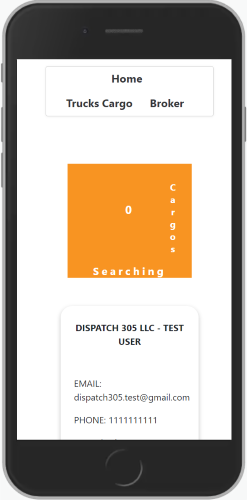
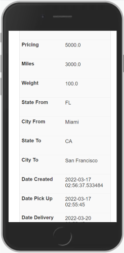
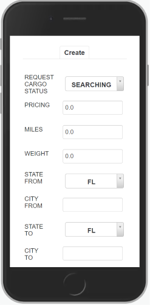
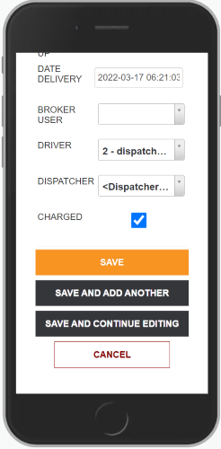
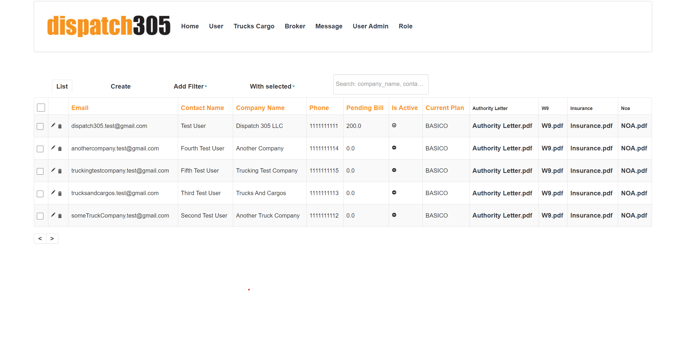
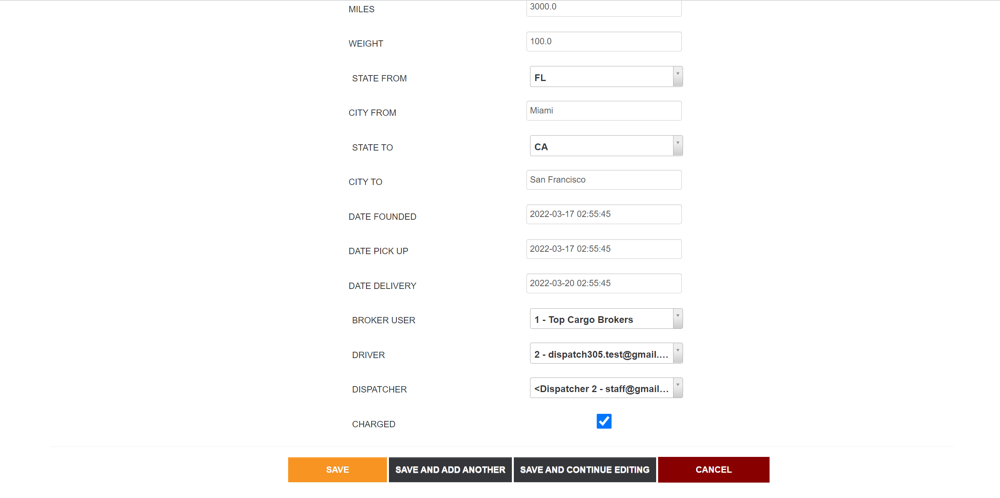
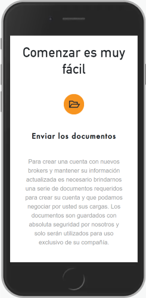
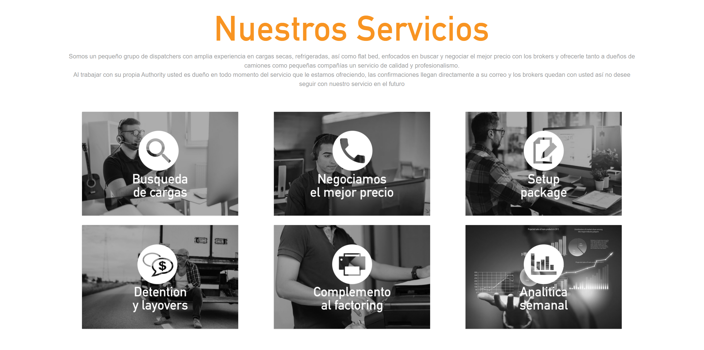

<div align="center">


# Dispatch305 Flask Backend API

    


</div>

## Table of Contents

1. [Description](#introduction)
1. [Install (Run) with Docker](#docker)
1. [Installation without Docker](#installation)
1. [Run with the React js Frontend (with and without Docker)](#connect_backend)
1. [Structure and apps](#structure)
1. [Deploying in VPS](#deploy)
1. [Screenshots of the Admin Panel](#screenshots)
1. [Screenshots of the Frontend React App](#screenshots_frontend)
1. [Useful Links](#useful_links)


<a name="introduction"></a>

## Description

__Dispatch305__ is a service that helps dispatchers to communicate with both drivers and brokers. From now on, we call __DISPATCH305__ to the company and all its components, and so we will often call  _drivers_ to the _clients_, while the _dispatchers_ will be called _staff members_ (of the company). In addition, the services offered by the website will be referred as:

- _Searching a Cargo_: When a client requests the dispatcher to look out for an Agency with a Cargo to transport. In this case the staff member should contact a broker (Agency) and make the arraignments.
- _Sending Analytics_: Every Friday, a bill should be sent to every client with the weekly pending bill amount and a description of the charges. In addition, for the clients with a VIP account, an analytics resume of the week should also be sent.
- _Managing POD_: When a Cargo is delivered, the VIP clients may request the staff member assigned to them to manage the sending of the _Rate Conf_ and the _POD_ (this are 2 PDF files needed as proof of service and delivery).

- ### How does Dispatch305 work?
1. __User Registration:__ First, the client registers at [dispatch305.com](https://www.dispatch305.com/create-account) (the Frontend website created using REACT js). During this step, the client should provide basic account information such as name, company, ..., and should also upload the 4 basic PDF files that most brokers require for hiring them to deliver cargo.
2. __Account Activation:__ When the new account is created, it is set to inactive and the _Admin User_ is notified. The, the _Admin User_ assigns a staff member to the client. From this point on, the staff member is said to be the client's dispatcher. The client must download the PDF that is under the section Agreement in the Frontend app. Once this steps are completed, the client's account is set to active.
3. __Requesting Services and Billing:__ Now and while the account is active, a client with a plan BASICO (basic account) can request the dispatcher to offer the service of _Searching a Cargo_, while VIP clients can ask for the services of _Searching a Cargo_, _Sending Analytics_, and  _Managing POD_. Regardless of which type of account a client has, a Bill will be sent to them with the pending amount to pay for the services offered in that week from DISPATCH305. When a user fails to pay the weekly bill (usually a timeline of 3 days offered), the account becomes inactive until the bill is paid.
4. __Factoring:__ After the user requests a _Searching a Cargo_ service, and the Cargo is found by the staff member, and later delivered by the client, if the client has a VIP account, the staff member can be requested to offer a _Managing POD_ service. In order to do that, the client must send the PDF files required, and the staff member should upload them to DISPATCH305's Admin Panel.

<a name="docker"></a>

## Install (Run) with Docker

1. Clone the repo:

   ```bash
   git clone https://github.com/Ceci-Aguilera/dispatch305_flask_backend_api.git
   ```

1. Install Docker and Docker Compose

1. Configure the environment variables using one of the following methods:

   i. Create an .env file inside the __config__ folder and set up the following environment variables:

   ```text
    SECRET_KEY                      (for example "someSecurityPassword")
    JWT_SECRET_KEY                  (use secrets.token_hex(12) from python secrets)
    SECURITY_PASSWORD_SALT          (for example "someSecurityPassword")
    ADMIN_EMAIL_CREDENTIAL          (email to use to create a Admin user)
    ADMIN_PASSWORD_CREDENTIAL       (the password for the Admin user)
    MAIL_SERVER                     (the server for sending emails using Flask-Mail)
    MAIL_PORT
    MAIL_PASSWORD
    MAIL_STRING_ID                  (a short random string to pass when using office 365)
    FRONTEND_APP                    (an allowed origin)
   ```

   or

   ii. Copy and modify the content of the .example.env file to the .env file:

   ```bash
   cp config/.example.env config/.env
   ```

1. Run the command:

   ```bash
   docker-compose up -d --build
   ```

1. Congratulations =) !!! the app should be running in [localhost:5000](http://localhost:5000)

<a name="installation"></a>

## Installation without Docker

1. Clone the repo:

   ```bash
   git clone https://github.com/Ceci-Aguilera/dispatch305_flask_backend_api.git
   ```

1. Create a virtual env and Pip install dependencies:

   ```bash
   pip install -r requirements.txt
   ```

1. Open the app.py file and change the parameter of create_app to 'development' (by default it is set to production)

1. Set up postgresql database ([See Useful Links](#useful_links)). For development the default credentials are:

   ```text
       Database name: test_db
       Database user: test_user
       Database password: test_pass
       Database host: localhost
       Database port: 5432
   ```

1. Config the environment variables using one of the following methods:

   i. Create an .env file inside the __config__ folder and set up the following environment variables:

   ```text
    SECRET_KEY                      (for example "someSecurityPassword")
    JWT_SECRET_KEY                  (use secrets.token_hex(12) from python secrets)
    SECURITY_PASSWORD_SALT          (for example "someSecurityPassword")
    ADMIN_EMAIL_CREDENTIAL          (email to use to create a Admin user)
    ADMIN_PASSWORD_CREDENTIAL       (the password for the Admin user)
    FRONTEND_APP                    (An allowed origin)
    MAIL_SERVER                     (the server for sending emails using Flask-Mail)
    MAIL_PORT
    MAIL_PASSWORD
    MAIL_STRING_ID                  (a short random string to pass when using office 365)
    FRONTEND_APP                    (an allowed origin)
   ```

   or

   ii. Copy and modify the content of the .example.env file to the .env file:

   ```bash
   cp config/.example.env config/.env
   ```

1. Run the migrations

   ```bash
   flask db init
   flask db migrate
   flask db upgrade
   ```

   __NOTE:__ In case of an error regarding revision of migration, run:

   ```bash
   flask db revision --rev-id <revision_id_in_error>
   flask db migrate
   flask db upgrade
   ```

1. Run the app

   ```bash
   python app.py
   ```

   __NOTE:__ To change the initial configuration edit the files __app.py__ and __config/config.py__ files. The env variables for the __config/config.py__ files are retrieved from __config/.env__ using __decouple.config__.

1. Congratulations =) !!! the app should be running in [localhost:5050](http://localhost:5050)


<a name="connect_backend"></a>
## Run with the React js Frontend (with and without Docker)

__Note:__ Before following these steps clone this repository. From now on the selected folder that contains the clone will be referred as __project_root__. So far, it should look like this:
   ```sh
      project_root
      └── dispatch305_flask_backend_api
   ```

1. Assuming that your are at the __project_root__, clone the [React Frontend repository](https://github.com/Ceci-Aguilera/dispatch305_react_frontend):
   ```sh
      git clone https://github.com/Ceci-Aguilera/dispatch305_react_frontend.git
   ```
   Now the __project_root__ folder should look like:
      ```sh
      project_root
      ├── dispatch305_flask_backend_api
      └── dispatch305_react_frontend
   ```

- ### If Using Docker and Docker Compose
   1. Copy the content of the docker-compose-connect.yml to a new file docker-compose.yml in the __project_root__. The docker-compose-connect.yml file can be found at the root of this repository and also at the root of the [React Frontend repository](https://github.com/Ceci-Aguilera/dispatch305_react_frontend) (Either file is fine to copy).
   1. Follow the instruction to configure the environment variables of the __Flask__ backend API that can be found in the section __Install (Run) with Docker__ in the Readme.md of the [React Frontend repository](https://github.com/Ceci-Aguilera/dispatch305_react_frontend). The only env variable needed is the Flask Backend url, which by default should be [http://localhost:5000](http://localhost:5000).
   1. Follow the instructions on the __Install (Run) with Docker__ section of this Readme.md to configure the environment variables for this repo.
   __Note:__ Right now the __project_root__ should look like:
         ```sh
         project_root
         ├── dispatch305_flask_backend_api
         ├── dispatch305_react_frontend
         └── docker-compose.yml
      ```

   1. Run the command:

      ```bash
      docker-compose up --build
      ```

   1. Congratulations =) !!! the frontend app should be running in [localhost:80](http://localhost:80) while the backend is at [localhost:5000](http://localhost:5000)


- ### Running without Docker and Docker Compose
   1. Follow the instructions of the __Installation without Docker__ section in the Readme.md of the  [React Frontend repository](https://github.com/Ceci-Aguilera/dispatch305_react_frontend) to configure and run the frontend. Modify the REACT_APP_API_DOMAIN_NAME to be the url of the __Flask__ Backend API (by default it is [http://localhost:5050](http://localhost:5050).
   1. Follow the instructions of section __Installation without Docker__ of this Readme.md.
   1. Congratulations =) !!! the frontend app should be running in [localhost:3000](http://localhost:3000) while the backend is at [localhost:5050](http://localhost:5050)

---


<a name="structure"></a>

## Structure and Apps
### Folders and Endpoints

Dispatch305 Backend-Api is divided in the following folders:

```text
.
├── api
│   ├── admin
│   ├── message
│   ├── static
│   │   ├── assets
│   │   └── css
│   ├── templates
│   │   ├── admin
│   │   ├── driver
│   │   ├── security
│   │   ├── staff
│   │   └── trucks_cargos
│   ├── trucks_cargo
│   └── user_account
├── config
├── migrations
└── uploads
```

- At the root is located a file named __app.py__ which together with the __config/config.py__ file determine the behavior of the Flask app, and so the .env file is located inside the __config__ folder. Most of the weight of the configuration is actually in the __init__.py file inside the __api__ folder. This __init.py__ file initializes most of the different pieces of the app such as the Database, Flask-Secure, Flask-Admin, .... Thus, in case of wanting to change what services are included this file will probably be the one to be altered.
- The __migrations__ folder contains all files auto-generated by Flask-SQLAlchemy.
- The __uploads__ folder has all the content uploaded from the clients, which is later divided into 2 type of sub-folders: __trucks-cargos__ which contains the _Rate Confirmation.pdf_ and the _POD.pdf_ files for each Cargo registered through the TrucksCargo model, and the {user-email} folders that are dynamically generated when a client registers and they are meant to store the 4 principal pdf files for the drivers setup with a new broker.
- Finally, the __api__ folder contains the main apps/folders of the project, each of them has a models.py file and a views.py file. In addition, it has the __static__ and __template__ folders that manage static files and html (jinja2) templates respectively.
- The __api/admin__ folder:
  - __models.py__: manages the UserAdmin model (in this case, the AdminUser model is different from the User model) and the Role model that are required by Flask-Security .
  - The __views.py__ file that is in the same folder has all the views that an AdminUser with role _admin_ or with the role _staff_ can see. In this case, not all views are available to both roles, as the _admin_ user is allowed to view/edit all models, while _staff_ users (dispatchers are the only AdminUser with _staff_ role) can only see their clients (which are instances of the User model, not the AdminUser model) that are active, and the TrucksCargo instances created by them (by the dispatchers). However, Brokers are available to be viewed/created by any dispatcher. Therefore, the only models available to the dispatchers are Users, TrucksCargo, and Brokers (with the limitations listed above)
- The __api/message__ folder has the Message model that manages the comments submitted by the clients that visit the website (not necessary users of Dispatch305)
  _ The __api/user_account__ folder manages the User (client) model and the api endpoints that are called by the React Frontend
- The __api/trucks_cargo__ folder has the TrucksCargo model which is the Cargo that the dispatcher must hire, and the Broker model which is the company that offers the Cargo. The views that are from the view.py file are registered, however never used

<a name="deploy"></a>

## Deploy to VPS using PostgreSQL, Nginx, and Gunicorn

1. Clone the repo:

   ```bash
   git clone https://github.com/Ceci-Aguilera/dispatch305_flask_backend_api.git
   ```

1. Install the dependencies:

   ```bash
   sudo apt-get update
   sudo apt-get install python3-pip python3-dev libpq-dev postgresql postgresql-contrib nginx
   ```

1. Set up the postgresql database ([See Useful Links](#useful_links))

1. Create an .env file and configure the environment variables

1. Create a virtual env and activate it:

   ```bash
   virtualenv myprojectenv
   source myprojectenv/bin/activate
   ```

1. Pip install the requirements:

   ```bash
   pip install -r requirements.txt
   ```

1. Pip install gunicorn:

   ```bash
   pip install gunicorn
   ```

1. Open app.py and add _host='0.0.0.0'_ to the create_app() function

1. Delete the __migrations__ folder in case it exits, and create an empty folder with the same name

1. Test configuration so far:

   ```bash
   flask db init
   flask db migrate
   flask db upgrade
   
   python app.py
   ```

1. Change the frontend domain for reset password in the api/templates/user-account/send-request-reset-password.html file (currently http://localhost:3000)

1. Create wsgi.py file:

   ```bash
   sudo vim wsgi.py
   ```

   and copy and paste this:

   ```python
   from app import app
    
   if __name__ == "__main__":
   app.run()
   ```

   and then run

   ```bash
   gunicorn --bind 0.0.0.0:5050 wsgi:app
   ```

12. Complete the setup of the website with this [link](https://www.digitalocean.com/community/tutorials/how-to-serve-flask-applications-with-gunicorn-and-nginx-on-ubuntu-20-04)

13. Set up Cors to allow the frontend to fetch and post requests ([See Useful Links](#useful_links))
 - ### Connecting to the React frontend

1. Configure Cors to allow React js axios calls (See [Link](https://stackoverflow.com/questions/64520497/how-would-i-make-it-so-a-flask-api-can-only-be-used-with-my-reactjs-app)). If running in development mode and with the React app running in localhost:3000, then no config is needed in Flask
1. Follow the instructions of the REACT Frontend repo: [Dipatch305 Frontend](https://github.com/Ceci-Aguilera/dispatch305_react_frontend) to run the React js app

<a name="screenshots"></a>

## Screenshots of the Admin Panel

<div align="center">

  

</div>

<div align="center">

  

</div>

---



---



<a name="screenshots_frontend"></a>

## Screenshots of the Frontend React App

<div align="center">

 

</div>

<div align="center">

 

</div>




 <a name="useful_links"></a>

## Useful Links

### Database (PostgreSQL and SQLAlchemy)

- Set up postgreSQL in Ubuntu (install + create database, user, and alter roles): [Link from DigitalOcean about deploying Django + Postgresql](https://www.digitalocean.com/community/tutorials/how-to-set-up-django-with-postgres-nginx-and-gunicorn-on-ubuntu-16-04)
- Create models and connecting them to the db using SQLAlchemy: [Link to Flask-SQLAlchemy official documentation](https://flask-sqlalchemy.palletsprojects.com/en/2.x/)
  - Managing Foreign Keys: One to One, One to Many, and Many to One: [Link to Flask-SQLAlchemy](https://flask-sqlalchemy.palletsprojects.com/en/2.x/models/)

### Authentication and Admin Panel

- Flask with JWT Authentication (For calls coming from the REACT frontend): [Link to Flask-JWT-Extended official documentation](https://flask-jwt-extended.readthedocs.io/en/stable/)
- Flask Security for the Admin Panel (Using Flask-Security-Too instead of Flask Security as it is deprecated): [Link to Flask-Security-Too official documentation](https://flask-security-too.readthedocs.io/en/stable/)
  - Useful Flask-Security-Too links from Github and Stackoverflow:
    - [FS Uniqufiers is mandatory for User model, and get_user function eliminated from version 4.0](https://github.com/Flask-Middleware/flask-security/issues/85)
    - [Custom Login html and overriding other templates](https://stackoverflow.com/questions/47317722/how-do-i-embed-a-flask-security-login-form-on-my-page)
    - [Flask-Security + Flask Admin when Authenticating user Resource 1](https://stackoverflow.com/questions/31091637/how-to-secure-the-flask-admin-panel-with-flask-security)
    - [Flask-Security + Flask Admin when Authenticating user Resource 2](https://gist.github.com/skyuplam/ffb1b5f12d7ad787f6e4)

    - Flask Admin Panel:
      - [Link to Flask-Admin official documentation](https://flask-admin.readthedocs.io/en/latest/)
      - [Link to Flask-Admin github](https://github.com/flask-admin/flask-admin)
      - [Link to Custom Formatter in Stackoverflow to implement a custom field](https://stackoverflow.com/questions/37258668/flask-admin-how-to-change-formatting-of-columns-get-urls-to-display)

### Rest Api using Restx

- [Link to Flask Restx official documentation](https://flask-restx.readthedocs.io/en/latest/)
- [Link to Flask Restx github](https://github.com/python-restx/flask-restx)

### Managing PDFs and other files

- [Save pdf and other file types from React Frontend](https://medium.com/excited-developers/file-upload-with-react-flask-e115e6f2bf99)
- [Send pdf file to Frontend](https://docs.faculty.ai/user-guide/apis/flask_apis/flask_file_upload_download.html)
- [Render PDF file in Browser using Flask](https://artsysops.com/2021/01/02/how-to-open-a-pdf-file-on-the-browser-with-flask/)

### Docker and Docker Compose with Flask + Postgresql

- [Dockerize Flask app with Postgresql, Guinicorn and Nginx](https://testdriven.io/blog/dockerizing-flask-with-postgres-gunicorn-and-nginx/#gunicorn)
- [Python Slim Buster error with gcc](https://github.com/watson-developer-cloud/python-sdk/issues/418)
- Using sh file in docker to init flask and run migrations: [Fix slim-buster with netcat, gcc, and g++](https://stackoverflow.com/questions/61726605/docker-entrypoint-sh-not-found)
- Why not using volumes in docker-compose for flask files: [Fix migrations folder is created and not empty error](https://stackoverflow.com/questions/69297600/why-isnt-my-dockerignore-file-ignoring-files)

### Sending Emails with Flask-Mail

- [Flask-Mail official documentation](https://pythonhosted.org/Flask-Mail/)
- [Flask-Mail with office 365 services issue with ID Stackoverflow Fix](https://stackoverflow.com/questions/54600601/i-am-using-office-and-flask-mail)

### Cors Headers Configuration

- [Example of simple Cors config for React js Frontend app](https://stackoverflow.com/questions/64520497/how-would-i-make-it-so-a-flask-api-can-only-be-used-with-my-reactjs-app)
